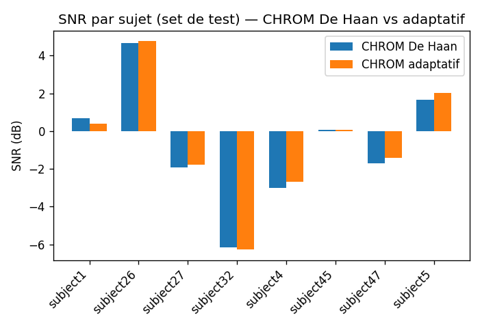
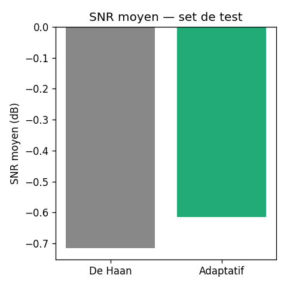

# CHROM adaptatif — Rapport de test (UBFC-rPPG, 28 sujets)

## Méthode

- Extraction du signal RGB (région front, MediaPipe FaceMesh) sur 28 sujets
  disposant d'une vidéo (`vid.avi`) et d'un signal BVP de référence
  (`ground_truth.txt`).
- Split : 20 sujets entraînement / 8 sujets test.
- Entraînement de **CHROM adaptatif** (5 coefficients `a1..a5` appris par
  descente de gradient, init = valeurs De Haan), 100 epochs, loss = corrélation
  de Pearson vs signal BVP de référence (filtré passe-bande).
- Comparaison sur le set de test : CHROM De Haan (coefficients fixes) vs
  CHROM adaptatif (coefficients appris).

## Coefficients obtenus

| Coefficient | Appris | De Haan | Écart |
|---|---|---|---|
| a1 | 2.508 | 3.0 | -0.49 |
| a2 | 1.455 | 2.0 | -0.55 |
| a3 | 1.711 | 1.5 | +0.21 |
| a4 | 0.992 | 1.0 | -0.01 |
| a5 | 1.416 | 1.5 | -0.08 |

`a4` reste quasi identique à De Haan, mais `a1`/`a2` s'écartent sensiblement
(-0.49 / -0.55). La loss était encore en légère baisse à la fin de
l'entraînement — des coefficients plus stables nécessiteraient probablement
plus d'epochs et/ou plus de sujets.

## Résultats (set de test, 8 sujets)

- **MAE HR (FFT)** : 0.1 bpm pour les deux variantes (le pic FFT du HR est
  quasiment inchangé).
- **SNR moyen** : De Haan = **-0.72 dB** vs Adaptatif = **-0.62 dB**
  (+0.1 dB), amélioration sur 6/8 sujets, légère dégradation sur 2/8
  (subject1, subject32).

### SNR par sujet

### SNR moyen

## Conclusion

Le gain de SNR est faible mais positif (+0.1 dB en moyenne, majoritaire sur
6/8 sujets), pour un coût de calcul quasi nul à l'inférence (mêmes
opérations que CHROM, coefficients différents). Les coefficients appris
restent dans un ordre de grandeur raisonnable par rapport à De Haan, sauf
`a1`/`a2` qui s'écartent d'environ 15-25 %.

**Pistes d'amélioration** : entraîner plus longtemps / sur plus de sujets,
et entraîner des modèles séparés par phototype (`SKIN_TYPE`, voir
`configs/chrom_adaptive/UBFC_CHROM_ADAPTIVE.yaml`) pour évaluer si le gain
est plus marqué sur certains phototypes.

## Modèle et artefacts

- Modèle entraîné : `weights/chrom_adaptive_ubfc.pth`
- Cache des signaux RGB extraits : `results/chrom_adaptive_cache/`
- Script utilisé : `scripts/eval_chrom_adaptive.py`
